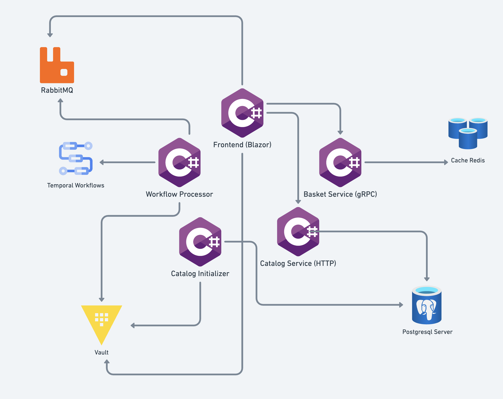

# Shadow Shop Sample 
A modified version of the [Aspire Shop](https://github.com/dotnet/aspire-samples/tree/main/samples/AspireShop) sample
application that adds integration with [Stripe](https://stripe.com) for payment processing, [temporal](https://temporal.io/)
for durable workflows, other custom Aspire Integrations. 

## Aspire Integrations
- [HashiCorp Vault](./src/ShadowShop.AppHost/Resources/VaultResource.cs) - Secret store
- [Temporal](./src/ShadowShop.AppHost/Resources/TemporalDevResource.cs) - Workflow Engine
- [Stripe](./src/ShadowShop.AppHost/Resources/StripeDevResource.cs) - Payment event proxy
- [Grafana](./src/ShadowShop.AppHost/Resources/GrafanaStackResource.cs) - OpenTelemetry server and UI

## Getting Setup

### Prerequisites
- [.NET SDK](https://get.dot.net/) 8.0 or later
- [.NET Aspire workload](https://learn.microsoft.com/en-us/dotnet/aspire/fundamentals/setup-tooling?tabs=linux&pivots=dotnet-cli)
- [Stripe account](https://dashboard.stripe.com) & [Stripe CLI](https://stripe.com/docs/stripe-cli)
- [Docker](https://www.docker.com)

### Run the solution

* Add your [Stripe API keys](https://dashboard.stripe.com/apikeys) to the [setup.sh](./src/ShadowShop.AppHost/.config/vault/setup.sh) file.
* Add your [Stripe Secret key](https://dashboard.stripe.com/apikeys)  to the AppHost's [appsettings.Development.json](./src/ShadowShop.AppHost/appsettings.Development.json) file.
* Run the [App Host](./src/ShadowShop.AppHost) project

### Troubleshooting
*Product images aren't showing*  
If the product items load without the images, purge the data by deleting the postgres volume and test data in the Stripe account.
Then try running the solution again.

*The webhook handle throws a StripeException because the API versions don't match*  
Make sure the API version in your Stripe account matches the version the [pinned version](https://github.com/stripe/stripe-dotnet/blob/master/src/Stripe.net/Constants/ApiVersion.cs#L6) for the .NET SDK. 

## Images
The product images were generated by [Canva AI Image Generator](https://www.canva.com/ai-image-generator/).

## License

The code in this repo is licensed under the [MIT](LICENSE) license.
